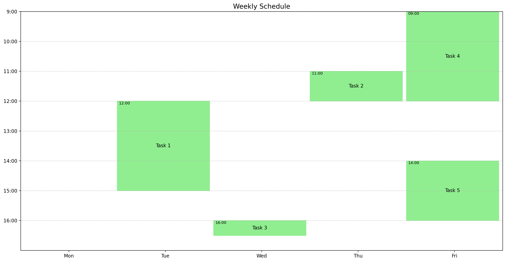

# my_weekly_schedule

Plot your weekly schedule from a simple text file with Python.

Inspired by [utkuufuk/weekplot](https://github.com/utkuufuk/weekplot).



## Installation

Run `pip install my_weekly_schedule` for the latest stable version.

### Development

This project uses [Python Poetry](https://python-poetry.org/) for dependency management.
You can install Python Poetry with the [following instructions](https://python-poetry.org/docs/#installation).

``` sh
poetry install
```

To run the code during development:

``` sh
poetry run python my_weekly_schedule/main.py example.txt
```

## Usage

You can run the default options with:

```sh
my_weekly_schedule example.txt
```

You can replace `example.txt` with your own schedule files.

You can list all CLI options with:

```sh
my_weekly_schedule --help
```

#### Example input files
 - [text](example.txt)

## Colors

You can use any color in [the CSS3 specification](https://www.w3.org/TR/css-color-3/#svg-color).
